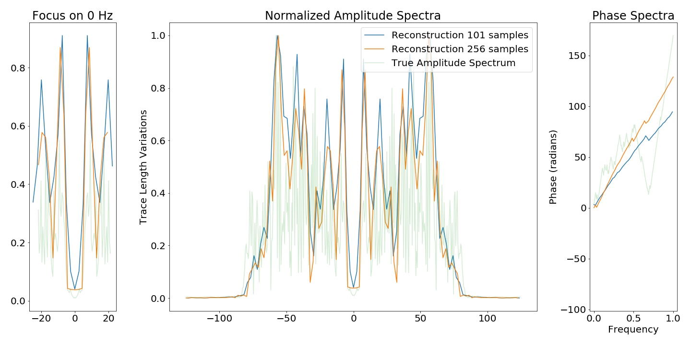

# Information Theory Considerations in Patch-based Training of Deep Neural Networks on Seismic Time-Series

This repository explores and reproduces frequency aliasing due to windowing of patches of seismic data in patch-based neural network training.

> [Dramsch, J. S.](https://orcid.org/0000-0001-8273-905X), & [Lüthje, M.](https://orcid.org/0000-0003-2715-1653). (2018, November). Information Theory Considerations in Patch-based Training of Deep Neural Networks on Seismic Time-Series. In First EAGE/PESGB Workshop Machine Learning.

